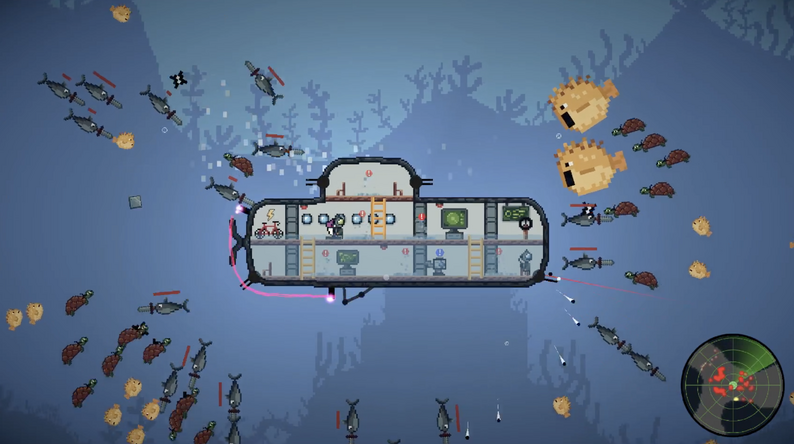

 
## [Sub-Merged Conflicts](https://amongnight.itch.io/sub-merged-conflicts)
Collaborative 7-week game design project where 
you and a friend are underwater explorers on a 
mission to find the treasure, navigate through treacherous currents,
encounter dangerous creatures, and use your teamwork skills to keep your submarine safe and strike gold!

    
    

 

    <a href="https://amongnight.itch.io/sub-merged-conflicts" class="btn btn--info btn--x-large">PLAY NOW</a>

 

## [Periodic Puffins](https://schefferac2020.github.io/PeriodicPuffin/)
A video game prototype by where you play as a pixelated puffin who's hungry for FISH. However, like in life, you're not in complete control...

    
    

 

    <a href="https://schefferac2020.github.io/PeriodicPuffin/" class="btn btn--info btn--x-large">PLAY NOW</a>

 

## [The Legend of Duck](https://schefferac2020.github.io/LegendOfZeldaWebsite/)
Video game design project by [Andrew Scheffer](https://github.com/schefferac2020) and [Christian Foreman](https://github.com/ChristianForeman) that implements the Legend of Zelda's first dungeon in addition to a custom level. For our custom level, our team implemented a duck controller. Every movement the player makes is mirrored by the duck which makes for very interesting puzzles and dangerous situations!

    
    

 

    <a href="https://schefferac2020.github.io/LegendOfZeldaWebsite/" class="btn btn--info btn--x-large">PLAY NOW</a>

 
