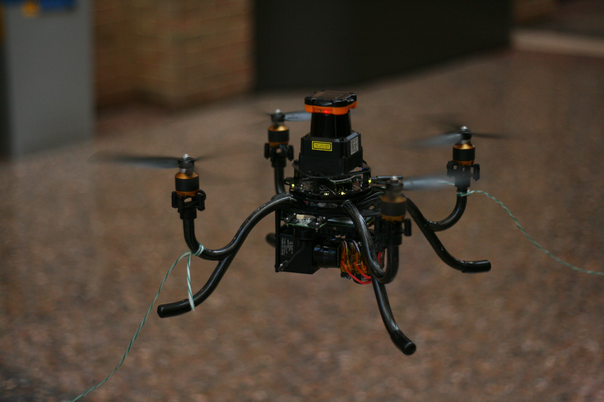
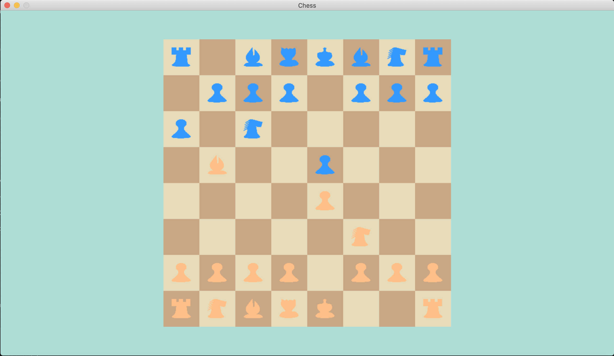

 
## Michigan Autonomous Aerial Vehicles (MAAV)
### **September 2020 - Present**
Lorem ipsum dolor sit amet, consectetur adipiscing elit, sed do eiusmod tempor incididunt ut labore et dolore magna aliqua. Ut enim ad minim veniam, quis nostrud exercitation ullamco laboris nisi ut aliquip ex ea commodo consequat. Duis aute irure dolor in reprehenderit in voluptate velit esse cillum dolore eu fugiat nulla pariatur. Excepteur sint occaecat cupidatat non proident, sunt in culpa qui officia deserunt mollit anim id est laborum.

    
    

 

    <a href="https://maavumich.org/" class="btn btn--info">Webpage</a>
    <a href="https://docs.google.com/presentation/d/1obzl3fJCuWeA-hCnCTQ13xH2WXBVU-1d5_IXDnswb-c/edit?usp=sharing" class="btn btn--info">Design Review</a>
    <a href="https://github.com/MAAV-Software/mission9-2022" class="btn btn--info">Github</a>

 
## Quick Action
### **Febuary 2023**
Lorem ipsum dolor sit amet, consectetur adipiscing elit, sed do eiusmod tempor incididunt ut labore et dolore magna aliqua. Ut enim ad minim veniam, quis nostrud exercitation ullamco laboris nisi ut aliquip ex ea commodo consequat. Duis aute irure dolor in reprehenderit in voluptate velit esse cillum dolore eu fugiat nulla pariatur. Excepteur sint occaecat cupidatat non proident, sunt in culpa qui officia deserunt mollit anim id est laborum.

    
    

 

    
    <a href="https://www.youtube.com/watch?v=JFAROM2cqHY&ab_channel=AndrewScheffer" class="btn btn--info">Demo</a>
    <a href="https://devpost.com/software/quick-action" class="btn btn--info">DevPost</a>
    <a href="https://github.com/schefferac2020/QuickAction" class="btn btn--info">Github</a>

 
## 3D Model Tracer
### **May 2021 - August 2021**
Lorem ipsum dolor sit amet, consectetur adipiscing elit, sed do eiusmod tempor incididunt ut labore et dolore magna aliqua. Ut enim ad minim veniam, quis nostrud exercitation ullamco laboris nisi ut aliquip ex ea commodo consequat. Duis aute irure dolor in reprehenderit in voluptate velit esse cillum dolore eu fugiat nulla pariatur. Excepteur sint occaecat cupidatat non proident, sunt in culpa qui officia deserunt mollit anim id est laborum.

    
    

 

    
    <a href="https://github.com/schefferac2020/3DModelTracer" class="btn btn--info">Github</a>

 

## Chess Engine
### **April 2021 - Present**
Lorem ipsum dolor sit amet, consectetur adipiscing elit, sed do eiusmod tempor incididunt ut labore et dolore magna aliqua. Ut enim ad minim veniam, quis nostrud exercitation ullamco laboris nisi ut aliquip ex ea commodo consequat. Duis aute irure dolor in reprehenderit in voluptate velit esse cillum dolore eu fugiat nulla pariatur. Excepteur sint occaecat cupidatat non proident, sunt in culpa qui officia deserunt mollit anim id est laborum.

    
    

 

    <a href="https://github.com/schefferac2020/ChessEngine" class="btn btn--info">Github</a>

 

## MWordle
### **January 2022 - April 2022**
Lorem ipsum dolor sit amet, consectetur adipiscing elit, sed do eiusmod tempor incididunt ut labore et dolore magna aliqua. Ut enim ad minim veniam, quis nostrud exercitation ullamco laboris nisi ut aliquip ex ea commodo consequat. Duis aute irure dolor in reprehenderit in voluptate velit esse cillum dolore eu fugiat nulla pariatur. Excepteur sint occaecat cupidatat non proident, sunt in culpa qui officia deserunt mollit anim id est laborum.

    
    

 

    
    <a href="https://github.com/michiganhackers/MWordle" class="btn btn--info">Github</a>

<!-- ## Meal Deals
Lorem ipsum dolor sit amet, consectetur adipiscing elit, sed do eiusmod tempor incididunt ut labore et dolore magna aliqua. Ut enim ad minim veniam, quis nostrud exercitation ullamco laboris nisi ut aliquip ex ea commodo consequat. Duis aute irure dolor in reprehenderit in voluptate velit esse cillum dolore eu fugiat nulla pariatur. Excepteur sint occaecat cupidatat non proident, sunt in culpa qui officia deserunt mollit anim id est laborum.
 

    
    <a href="../files/OMR.pdf" class="btn btn--info">Paper</a>
    <a href="https://docs.google.com/presentation/d/1gJXebLtSk_aEQmRz560zlnhtEXsTd7i0ni7cTAFL8mE/edit?usp=sharing" class="btn btn--info">Pitch Deck</a>
    <a href="https://github.com/AshwinS27/TrebleInTheSheets" class="btn btn--info">Github</a>

 -->

## GGBLost
### **Febuary 2023 - April 2023**
Lorem ipsum dolor sit amet, consectetur adipiscing elit, sed do eiusmod tempor incididunt ut labore et dolore magna aliqua. Ut enim ad minim veniam, quis nostrud exercitation ullamco laboris nisi ut aliquip ex ea commodo consequat. Duis aute irure dolor in reprehenderit in voluptate velit esse cillum dolore eu fugiat nulla pariatur. Excepteur sint occaecat cupidatat non proident, sunt in culpa qui officia deserunt mollit anim id est laborum.

    
    

 

    
    <a href="https://github.com/AshwinS27/TrebleInTheSheets" class="btn btn--info">Github</a>

