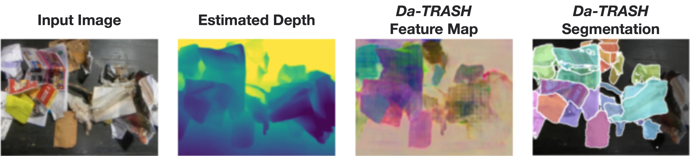
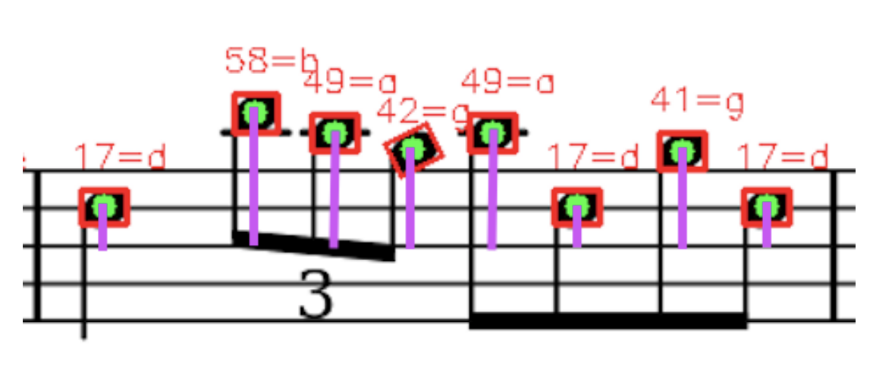

## *Da-TRASH*: Depth-appended Tabletop Recycling Algorithm for Segmenting Havoc
### *Class Project | Winter 2023*
In this work, we set out to reproduce and build upon the results presented in Learning RGB-D Feature Embeddings for Unseen Object Instance Segmentation (Xiang et al., 2021). Additionally, our team extends upon previous work by adapting the existing UOIS model such that it can perform segmentation on RGB-only images. By fusing the RGB-only input images with output from a monocular depth estimation sub-network, our proposed *Da-TRASH* model is able to operate in environments and on robotic platforms where depth sensors are inadequite or unavailable. \
 \
[Webpage](https://deeprob.org/w23/reports/da-trash/) | [Paper](../files/Da-TRASH.pdf) | [Github](https://github.com/schefferac2020/Da-TRASH)

## Automated Discourse Identification in Argumentative Essays
### *Class Project | Winter 2023*
In an attempt to fulfill the need for the high demand of affordable Automated Essay Scoring (AES) systems, this work presents a customized Discourse Segmentation Model, a critical component of the AES pipeline. Discourse Segmentation requires the accurate categorization of different argumentative elements in essays, which allows downstream AES systems to analyze essay structure, factual basis, etc. Our system takes argumentative essays as input and outputs a sequence of tokens indicating the corresponding argumentative element for each word of the essay. Our team uses data from the PERSUADE Corpus in conjunction with an encoder transformer model to perform this sequencing task. \
 \
[Paper](../files/NLP.pdf) | [Github](https://github.com/schefferac2020/EssayClaimIden)

## Search and Rescue Autonomous System (SARAS)
### *Class Project | Fall 2022*
Search And Rescue Autonomous System (a.k.a SARA), refers to a highly integrated, fully automated, and functionally precise robotics operational system which aims to guide a malfunctioning robot back to its destination. The goal of the SARA is to autonomously locate a stranded “Blind” robot, which is unable to read its LiDAR data, within an unknown environment and return it to a home base. This rescue is performed autonomously by a “Seeker” bot. The SARA system is designed to be deployed in most of the complicated landscapes on Earth. Space exploration and rescue missions are also possible. \

[Paper](../files/SARAS.pdf)

## Treble in the Sheets: Optical Music Recognition
### *Class Project | Winter 2022*
In an attempt to fulfill the need for this high demand, this work presents a simplified optical musical recognition system, modeled off the state-of-the-art OMR pipeline. Our system takes images of sheet music as input and outputs both an image of the annotated sheet music and a MIDI file containing the machine-readable representation of the sheet music. Our team used the DeepScores V2 dataset in conjunction with an encoder-decoder (U-net) model to perform semantic segmentation. This segmented image was then further processed to reconstruct basic music semantics. This process was evaluated using both qualitative and quantitative test metrics. \
 \
[Paper](../files/OMR.pdf) | [Github](https://github.com/AshwinS27/TrebleInTheSheets)

